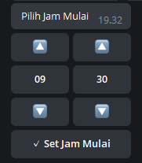

# go-timepicker-telegram
Timepicker for telegram bot writen in GoLang

## Sample preview from Telegram


## Usage
```go
package main

import (
	"fmt"
	"strings"

	tgbotapi "github.com/go-telegram-bot-api/telegram-bot-api"
	tp "timepicker"
)
func main() {

    bot, err := tgbotapi.NewBotAPI("YOUR-BOT-KEY")

    if err != nil {
      log.Fatal(err)
    }

	bot.Debug = true

	log.Printf("Authorized on account %s", bot.Self.UserName)

	updateConfig := tgbotapi.NewUpdate(0)
	updateConfig.Timeout = 60

	updChannel, err = bot.GetUpdatesChan(updateConfig)
	if err != nil {
		log.Fatalln(err)
	}

    for update := range updChannel {  
        msg := fmt.Sprintln("Pilih Jam Mulai")
        setMsg := "Set Jam Mulai"

        keyboard := tp.CreateTimepicker(setMsg, tp.JamPertama, tp.MenitPertama)

        reply := tgbotapi.NewMessage(update.Message.Chat.ID, msg)
        reply.ReplyMarkup = &keyboard
        bot.Send(reply)
     }
}
```
